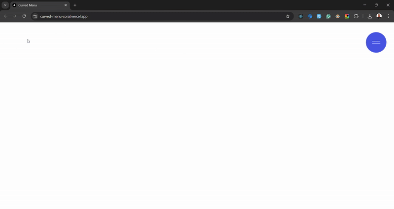

## Curved Menu

A curved menu project using Next.js and Motion (prev. Framer Motion). Inspired from https://dennissnellenberg.com/



### Usage

### Clone the Repository

```bash
git clone https://github.com/arvinbuid/curved-menu.git
```

#### Install npm dependencies

```bash
npm install
```

### Run in development mode

```bash
npm run dev
```

Open [http://localhost:3000](http://localhost:3000) with your browser to see the result.
